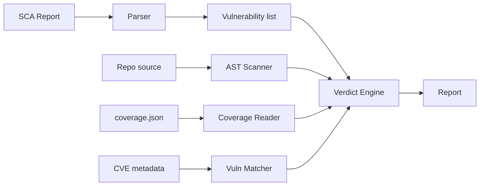

# Architecture Overview

ca9 is designed as a layered pipeline: **parse → analyze → decide → report**.

## High-level flow



## Module map

```
src/ca9/
├── models.py              # Frozen dataclasses: Vulnerability, Verdict, Report, etc.
├── engine.py              # Verdict engine — orchestrates the decision tree
├── scanner.py             # OSV.dev API client for `ca9 scan`
├── report.py              # Output formatting (JSON / ASCII table)
├── version.py             # PEP 440 version range comparison
├── cli.py                 # Click CLI entry point
├── analysis/
│   ├── ast_scanner.py     # Static analysis — AST import tracing
│   ├── coverage_reader.py # Dynamic analysis — coverage.py JSON reader
│   └── vuln_matcher.py    # Affected component extraction (4 strategies)
└── parsers/
    ├── base.py            # SCAParser protocol
    ├── snyk.py            # Snyk JSON parser
    └── dependabot.py      # Dependabot alerts parser
```

## Design principles

### Zero runtime dependencies

The core library uses only the Python standard library. The `click` dependency is optional and only needed for the CLI. This means ca9 can be embedded in other tools without pulling in a dependency tree.

### Frozen dataclasses

All data models are frozen (immutable) dataclasses. This makes the data flow predictable and prevents accidental mutation.

### Protocol-based parsers

Parsers implement the `SCAParser` protocol — no base class inheritance required. This makes it easy to add new SCA formats without modifying existing code.

### Layered analysis

Each analysis technique (static, dynamic, submodule matching) is a separate module. The verdict engine orchestrates them but doesn't implement any analysis logic itself.

## Data flow

1. **Input** — An SCA report (Snyk/Dependabot JSON) or installed packages (via `importlib.metadata`)
2. **Parsing** — Auto-detected parser converts raw JSON into `Vulnerability` objects
3. **Analysis preparation**:
    - AST scanner collects all imports from the repository
    - Coverage reader loads executed file data (if provided)
    - Vuln matcher extracts affected components from CVE metadata
4. **Verdict engine** — Walks the decision tree for each vulnerability
5. **Output** — Results formatted as JSON or ASCII table
