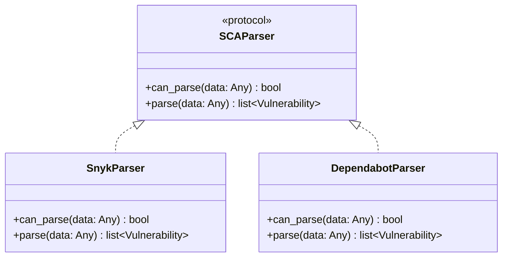

# Parser Architecture

ca9 uses a protocol-based parser system for SCA report ingestion.

## Design



The `SCAParser` protocol defines two methods:

- **`can_parse(data)`** — Returns `True` if this parser understands the given data structure
- **`parse(data)`** — Converts the raw data into a list of `Vulnerability` objects

## Auto-detection

```python
from ca9.parsers import detect_parser

parser = detect_parser(Path("report.json"))
vulnerabilities = parser.parse(json.loads(Path("report.json").read_text()))
```

`detect_parser()` loads the JSON file and tries each registered parser in order. The first one where `can_parse()` returns `True` is selected. Raises `ValueError` if no parser matches.

## Built-in parsers

### Snyk

Detects Snyk reports by checking for the `vulnerabilities` key (single project) or an array of objects with `vulnerabilities` keys (multi-project).

### Dependabot

Detects Dependabot alerts by checking for an array of objects with `security_advisory` and `dependency` keys.

## Adding a new parser

1. Create `src/ca9/parsers/mytool.py`:

```python
from typing import Any
from ca9.models import Vulnerability

class MyToolParser:
    def can_parse(self, data: Any) -> bool:
        # Check for distinguishing keys/structure
        if isinstance(data, dict) and "my_tool_version" in data:
            return True
        return False

    def parse(self, data: Any) -> list[Vulnerability]:
        results = []
        for item in data["findings"]:
            results.append(Vulnerability(
                id=item["id"],
                package_name=item["package"],
                package_version=item["version"],
                severity=item.get("severity", "unknown"),
                title=item.get("title", ""),
                description=item.get("description", ""),
            ))
        return results
```

2. Register it in `src/ca9/parsers/__init__.py`:

```python
from ca9.parsers.mytool import MyToolParser

_PARSERS = [SnykParser(), DependabotParser(), MyToolParser()]
```

The order matters — the first matching parser wins.
